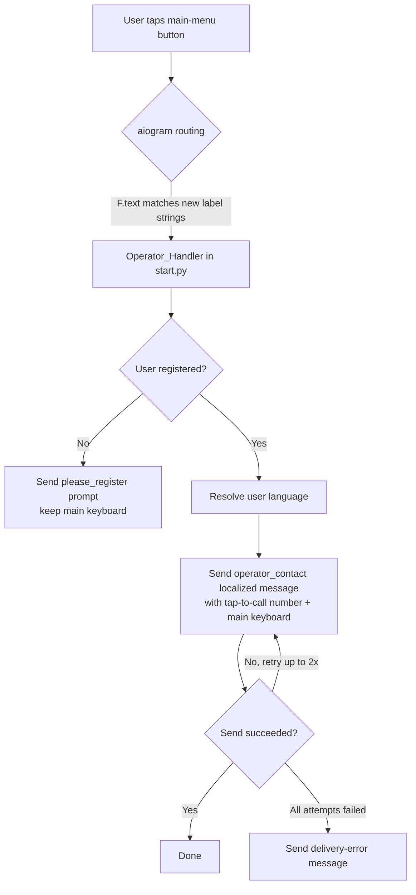
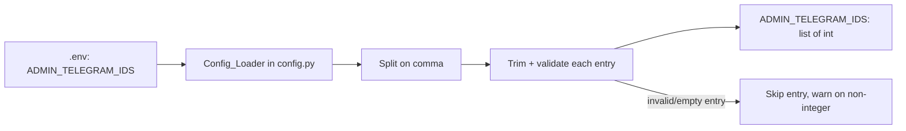

# Design Document

## Overview

This feature makes the "human operator" reachable directly by phone from inside the OKS Suv Telegram bot. It is a small, focused change that touches four existing files and one environment file. There is no new subsystem, no database change, and no new external dependency.

The work breaks down into three coordinated changes:

1. **Configuration** — add a second administrator Telegram ID (`8816532579`) to the `ADMIN_TELEGRAM_IDS` environment variable so the new operator receives admin-facing notifications. The existing parser in `bot/config.py` already handles comma-separated lists, so this is primarily a data change plus verification that the parser behaves correctly for the multi-ID case and rejects malformed entries gracefully.
2. **Rebranding the button** — rename the main-menu button from "Support" (`btn_support`) to "Contact Operator" across all three supported languages (uz/ru/en). The label lives in the `TRANSLATIONS` dictionary in `bot/localization.py` and is rendered by `get_main_keyboard` in `bot/keyboards/reply.py`. Because the keyboard reads the label through `get_text`, changing the translation value automatically updates the rendered button.
3. **Tap-to-call response** — when a registered user presses the button, the bot replies with a localized message that contains the operator phone number in a format Telegram auto-links as tap-to-call. The number reused is the one already present in the codebase: `+998 99 058 22 22`. Unregistered users get the standard registration prompt instead.

### Key design decisions

- **Reuse the existing phone number.** The number `+998 99 058 22 22` already appears in the `support_sent` localization text. We reuse it rather than introduce a new constant, keeping a single source of truth for the operator's contact number.
- **Reuse the existing handler, retarget its filter.** The current `support` handler in `bot/handlers/start.py` is matched by `F.text.in_(["📞 Qo'llab-quvvatlash", "📞 Поддержка", "📞 Support"])`. Since the button label strings change, this filter MUST be updated to the new label strings, otherwise the button press will not be routed to the handler.
- **Drop the "forward request to admins" behavior.** The existing handler messages all admins and forwards the user's message. The new feature is about *the user calling the operator*, not *the operator being notified*. Requirement 3 describes only sending the contact message back to the user; it does not require admin notification. Keeping the forward would send admins a "support request" every time someone taps to view the phone number, which is noise. We therefore remove the admin-forwarding logic from this handler. (Adding the new admin ID in Requirement 1 is a separate concern — it ensures the new operator receives admin messages generated elsewhere, e.g. order notifications.)
- **Telegram tap-to-call formatting.** Telegram auto-detects phone numbers and renders them as tap-to-call links when the number is in international format (a leading `+` followed by digits, optionally spaced). The existing string `+998 99 058 22 22` already satisfies this. Requirement 3.2 asks for a "+" country code followed by digits; spacing between digit groups does not break Telegram's detection, so we keep the readable spaced form.

## Architecture

The feature sits entirely within the existing aiogram bot. No new components are introduced. The flow for a button press is:



Configuration loading happens once at startup, independent of the button flow:



### Affected files

| File | Change |
| --- | --- |
| `.env` | Append `8816532579` to `ADMIN_TELEGRAM_IDS` (comma-separated). |
| `bot/config.py` | Verify/harden the `ADMIN_TELEGRAM_IDS` parser so invalid entries are skipped with a warning; behavior otherwise unchanged. |
| `bot/localization.py` | Update `btn_support` label text (uz/ru/en) to the new "Contact Operator" wording; add/update the operator contact message key holding the tappable number. |
| `bot/keyboards/reply.py` | No structural change — `get_main_keyboard` already renders `btn_support` via `get_text`. The new label flows through automatically. |
| `bot/handlers/start.py` | Update the `F.text.in_([...])` filter to the new label strings; send the localized operator contact message with retry; remove admin-forwarding logic. |

## Components and Interfaces

### Config_Loader (`bot/config.py`)

The existing line is:

```python
ADMIN_TELEGRAM_IDS = [int(x) for x in os.getenv("ADMIN_TELEGRAM_IDS", "").split(",") if x]
```

This handles the happy path and empty-string entries (via `if x`), but:
- It does **not** trim surrounding whitespace, so `" 8816532579"` would raise `ValueError` and crash startup.
- It does **not** skip non-integer entries gracefully; a single bad entry aborts the whole comprehension.

To satisfy Requirement 1 (acceptance criteria 4 and 5), the parser is hardened to trim whitespace, skip empty/whitespace-only and non-integer entries, and log a warning for rejected non-integer values while preserving order:

```python
def _parse_admin_ids(raw: str) -> list[int]:
    ids: list[int] = []
    for entry in raw.split(","):
        trimmed = entry.strip()
        if not trimmed:
            continue
        try:
            ids.append(int(trimmed))
        except ValueError:
            logger.warning("Ignoring invalid ADMIN_TELEGRAM_IDS entry: %r", entry)
    return ids

ADMIN_TELEGRAM_IDS = _parse_admin_ids(os.getenv("ADMIN_TELEGRAM_IDS", ""))
```

**Interface (unchanged for consumers):** `ADMIN_TELEGRAM_IDS: list[int]` remains a module-level list of integers, consumed by handlers and services exactly as before.

### Localization_Store (`bot/localization.py`)

Two entries change/added, each with all three languages:

- `btn_support` — relabeled. New values:
  - `uz`: `"📞 Operator bilan bog'lanish"`
  - `ru`: `"📞 Связаться с оператором"`
  - `en`: `"📞 Contact Operator"`

  (The 📞 emoji prefix is retained for visual consistency with the other menu buttons. The label text itself matches the confirmed wording. Each label is between 1 and 64 characters, satisfying AC 2.4.)

- `operator_contact` — the message shown on button press, containing the tappable number `+998 99 058 22 22`. Example (uz):
  ```
  📞 <b>Operator bilan bog'lanish</b>

  Quyidagi raqamga bosib qo'ng'iroq qiling:
  ☎️ <b>+998 99 058 22 22</b>

  Operatorlarimiz siz bilan bog'lanishga tayyor. 😊
  ```
  with `ru` and `en` equivalents. This may reuse/replace the existing `support_sent` text, which already contains the same number.

**Interface (unchanged):** `get_text(key, lang, **kwargs)` continues to be the single accessor. It already falls back to `uz` when a language is missing, which satisfies the "default language" acceptance criteria (2.6, 3.4).

### Main_Keyboard (`bot/keyboards/reply.py`)

`get_main_keyboard(lang)` already builds the support button with `KeyboardButton(text=get_text("btn_support", lang))`. No code change is required; the relabeled translation propagates automatically. This is verified rather than modified.

### Operator_Handler (`bot/handlers/start.py`)

The handler decorator filter changes from the old labels to the new ones. Because `F.text.in_([...])` matches literal rendered button strings, the list MUST contain the exact new label strings (including the emoji prefix) for all three languages:

```python
@router.message(F.text.in_([
    "📞 Operator bilan bog'lanish",
    "📞 Связаться с оператором",
    "📞 Contact Operator",
]))
async def contact_operator(message: Message):
    async with get_db() as session:
        user = await crud.get_user_by_telegram_id(session, message.from_user.id)

    if not user:
        await message.answer(get_text("please_register", "uz"))
        return

    lang = user.language
    # send operator_contact with retry (see Error Handling)
```

The handler no longer loops over `ADMIN_TELEGRAM_IDS` to forward the message; it only sends the localized `operator_contact` message together with the main keyboard.

## Data Models

This feature introduces no new persistent data models and no database schema changes.

The only structured data involved:

- **`ADMIN_TELEGRAM_IDS: list[int]`** — an in-memory list of administrator Telegram IDs derived from the environment variable. Ordering follows the left-to-right order of the source string. After this change the `.env` value becomes `8536944196,8816532579`, yielding `[8536944196, 8816532579]`.
- **Localization entries** — `dict[str, dict[str, str]]` shape (key → language → text), consistent with the existing `TRANSLATIONS` structure. No shape change, only added/edited values.

## Correctness Properties

*A property is a characteristic or behavior that should hold true across all valid executions of a system — essentially, a formal statement about what the system should do. Properties serve as the bridge between human-readable specifications and machine-verifiable correctness guarantees.*

The most valuable target for property-based testing here is the `ADMIN_TELEGRAM_IDS` parser: a pure function with a large input space (arbitrary comma-separated tokens) where ordering, whitespace, and invalid entries create meaningful edge cases. The localization and handler behaviors also yield a few universal properties over the fixed set of supported languages and the unregistered-user input space.

The following properties were derived from the prework analysis after consolidating redundant criteria (1.2 + 1.3 → Property 1; 1.4 + 1.5 → Property 2; 2.4 + 2.5 → Property 3).

### Property 1: Admin ID parsing preserves all valid IDs in order

*For any* list of valid integer administrator IDs (length 0 to 100), joining them with commas and parsing the result SHALL return exactly those integers, in the same left-to-right order, with none dropped or added.

**Validates: Requirements 1.2, 1.3**

### Property 2: Admin ID parsing skips invalid entries without crashing

*For any* input string formed by interleaving valid integer IDs with blank tokens (empty or whitespace-only) and non-integer tokens in any order, parsing SHALL return exactly the valid integer IDs in their original relative order, SHALL never raise an exception, and SHALL emit a warning for each rejected non-integer token.

**Validates: Requirements 1.4, 1.5**

### Property 3: Every supported language has a valid, rendered operator button label

*For any* supported language (uz, ru, en), the operator button label SHALL be a non-empty string between 1 and 64 characters, and the main keyboard rendered for that language SHALL contain that exact label.

**Validates: Requirements 2.4, 2.5**

### Property 4: The operator phone number is tap-to-call formatted

*For any* supported language, the phone number contained in the operator contact message, after removing spaces, SHALL consist of a leading "+" followed by digits only (matching `^\+\d+$`), so that Telegram renders it as a tap-to-call link.

**Validates: Requirements 3.2**

### Property 5: The operator contact message is localized to the user's language

*For any* registered user with a selected supported language, pressing the operator button SHALL result in the bot sending the operator contact message text for that language.

**Validates: Requirements 3.3**

### Property 6: Unregistered users never receive the operator contact message

*For any* unregistered user (no stored record), pressing the operator button SHALL result in the registration-prompt message being sent and SHALL NOT result in the operator contact message being sent.

**Validates: Requirements 3.6**

## Error Handling

### Configuration parsing (Requirement 1.4, 1.5)

- **Blank entries** (empty or whitespace-only between commas): silently skipped. This is expected input, not an error.
- **Non-integer entries**: skipped and logged at warning level via the module logger (`logger.warning`), including the offending raw value. Parsing continues with the remaining entries so one bad value never prevents the bot from starting.
- **Unset/empty variable**: yields an empty list `[]`. Downstream consumers already iterate over the list, so an empty list is safe (no admin messages sent, no crash).

### Operator contact message delivery (Requirement 3.7, 2.8)

- The send is wrapped in a retry loop: the initial attempt plus up to 2 additional retries (3 attempts maximum).
- If an attempt raises (network/Telegram API error), it is caught and the next attempt is made.
- If all 3 attempts fail, the bot sends a localized error message indicating the operator contact could not be delivered, and the main keyboard is preserved so the user can retry from the menu.

```python
last_error = None
for attempt in range(3):  # 1 initial + 2 retries
    try:
        await message.answer(
            get_text("operator_contact", lang),
            reply_markup=get_main_keyboard(lang),
        )
        return
    except Exception as e:
        last_error = e
        logger.warning("operator_contact send failed (attempt %d): %s", attempt + 1, e)
await message.answer(
    get_text("operator_contact_error", lang),
    reply_markup=get_main_keyboard(lang),
)
```

- A new localized key `operator_contact_error` is added for the failure message in all three languages.

### Unregistered user (Requirement 3.6)

- Handled by an early return: if `get_user_by_telegram_id` returns `None`, the bot sends `please_register` and does not proceed to send the contact message.

## Testing Strategy

This feature mixes a genuinely property-testable pure function (the config parser) with data/UI changes and framework-routed handler behavior. The strategy is therefore split accordingly.

### Property-based tests

- **Library**: `hypothesis` (the standard property-based testing library for Python). It MUST be used rather than hand-rolling generators.
- **Configuration**: each property test runs a minimum of 100 iterations (Hypothesis default `max_examples` is 100; keep or raise it).
- **Tagging**: each property test is tagged with a comment referencing the design property, in the format:
  `# Feature: operator-contact, Property {number}: {property_text}`
- **Coverage**:
  - Property 1 & 2 target the extracted `_parse_admin_ids` function in `bot/config.py`. To make it testable in isolation, the parsing logic is factored into a pure function that takes the raw string and returns `list[int]` (rather than reading `os.getenv` inline).
  - Property 3 iterates over the three supported languages, checking label validity and keyboard rendering.
  - Property 4 iterates over the three languages, extracting and validating the phone number format.
  - Properties 5 & 6 exercise the handler with a mocked DB session and a mocked `Message`/bot, asserting on what text is sent.

### Unit / example tests

- Requirement 1.1: parse `"8536944196,8816532579"` and assert both integers are present.
- Requirement 1.6: parse `""` → `[]`.
- Requirements 2.1–2.3: assert each language label matches the confirmed wording.
- Requirement 2.6: keyboard built with default language contains the Uzbek label.
- Requirement 2.8 / 3.7: mock the send to fail 1×, 2×, and 3×; assert success after retries in the first two cases, and an error message after 3 failures. Assert attempts never exceed 3.
- Requirement 3.4: registered user with unknown/None language receives the Uzbek message.
- Requirement 3.5: a single `answer` call carries both the contact text and the main keyboard.

### Integration / routing checks

- Requirement 2.7: verify the handler's `F.text.in_([...])` filter matches each of the three new label strings and that no other handler in the router collides with them.

### Non-tested (operational)

- Requirement 3.1 (3-second latency) is a runtime/operational concern dependent on network and Telegram; it is not covered by automated tests. The functional "message is sent" behavior it depends on is covered by the handler tests above.

### Manual verification

- Update `.env` and confirm the bot starts and both admin IDs are loaded.
- In a live/staging Telegram chat, confirm the relabeled button appears in each language and tapping the number initiates a call (tap-to-call rendering).
